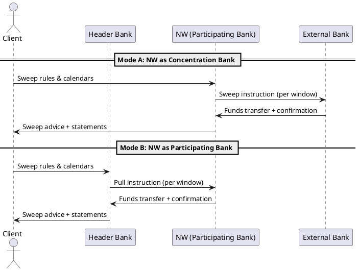

# MBCC exmaple

```plantuml
@startuml
actor Client
participant "Header Bank" as HB
participant "NW (Participating Bank)" as NW
participant "External Bank" as EB

== Mode A: NW as Concentration Bank ==
Client -> NW: Sweep rules & calendars
NW -> EB: Sweep instruction (per window)
EB -> NW: Funds transfer + confirmation
NW -> Client: Sweep advice + statements

== Mode B: NW as Participating Bank ==
Client -> HB: Sweep rules & calendars
HB -> NW: Pull instruction (per window)
NW -> HB: Funds transfer + confirmation
HB -> Client: Sweep advice + statements
@enduml
```